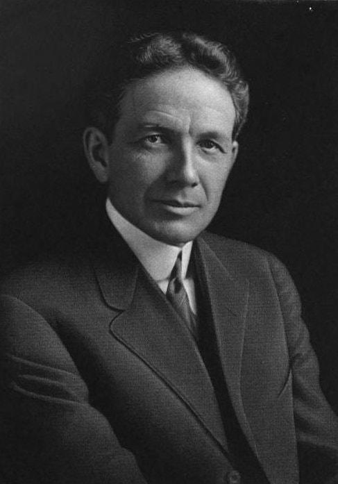
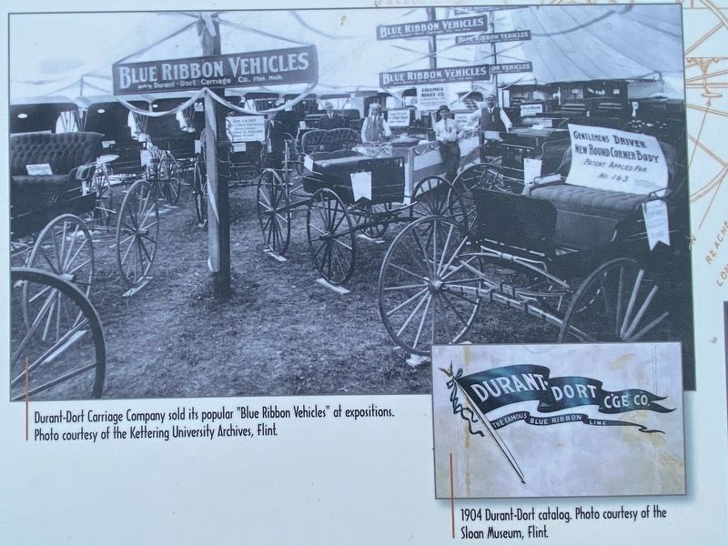
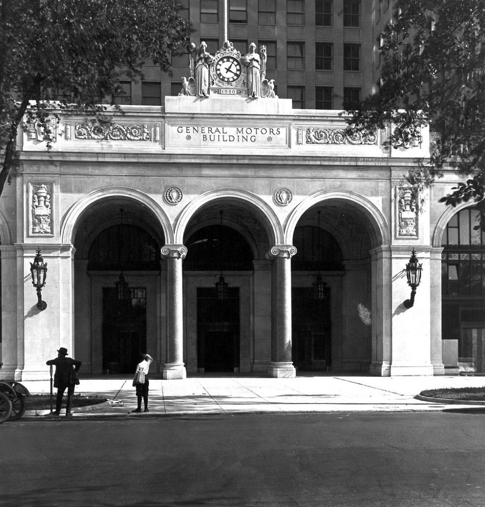
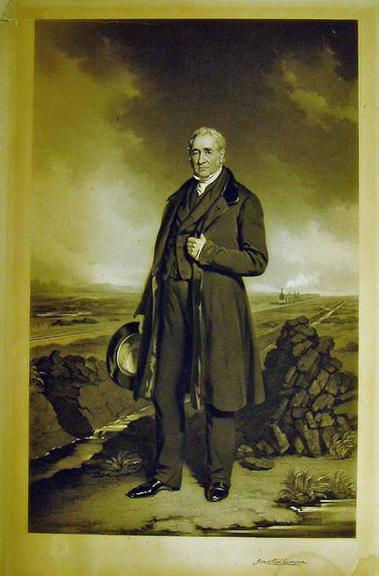

# How to stay relevant in a world where the machines do all the work

---
layout: center
class: headline-collage
---

  
  
  
  
  
  
  
  
  
  
  
  
  
  
  
  
  

<!--
[Sources]
- User-provided article URLs, captured as title-only images in assets/headlines/ on 2026-08-28.
[/Sources]
-->

---
layout: center
class: image-slide
---

<!--
[Sources]
- StaDaFa.com chart; underlying data sources are credited within the image.
[/Sources]
-->

---
layout: center
class: statement-slide
---

# You are not a horse.

---
layout: center
class: conversion-slide
---

  

    
🥕

    
Food

  

  
→

  

    
🐎

    
Horse

  

  
→

  

    
💪

    
Mechanical work

  

---
layout: center
class: ai-claim-slide
transition: none
---

# AI won’t take your job. Someone using AI will.

---
layout: center
class: ai-claim-slide ai-claim-stamped-slide
---

  <h1>AI won’t take your job. Someone using AI will.</h1>
  
Bullshit

---
layout: center
class: profession-triptych
transition: none
---

  
  
  

<!--
[Sources]
- RDNE Stock project on Pexels: https://www.pexels.com/photo/a-man-sitting-at-the-table-7821715/
- Christina Morillo on Pexels: https://www.pexels.com/photo/photo-of-woman-pointing-on-white-paper-1181487/
- ThisIsEngineering on Pexels: https://www.pexels.com/photo/woman-coding-on-computer-3861958/
[/Sources]
-->

---
layout: center
class: profession-triptych
---

  
  
  

<!--
[Sources]
- Derived from the preceding Pexels photographs with robot-face overlays generated using OpenAI image generation.
[/Sources]
-->

---
layout: center
class: timeline-slide
---

<!--
[Sources]
- Original illustration generated for this presentation with OpenAI image generation.
[/Sources]
-->

---
layout: center
class: factory-video-slide
---

<SlidevVideo autoplay autoreset="slide" muted playsinline>
  <source src="./assets/factory/steam-factory.mp4" type="video/mp4" />
</SlidevVideo>

<!--
[Sources]
- User-provided video: assets/factory/steam-factory.mp4
[/Sources]
-->

---
layout: center
class: edison-slide
---

<!--
[Sources]
- U.S. National Park Service, “Thomas Edison holding bulb or test tube” (1905), public domain: https://npgallery.nps.gov/AssetDetail/49d152238b9944e280370f2672d02257
[/Sources]
-->

---
layout: center
class: electrified-factory-slide
---

  
  
⚡

<!--
[Sources]
- Opening frame extracted from the user-provided video: assets/factory/steam-factory.mp4
[/Sources]
-->

---
layout: center
class: "durant-diptych red-flag-full-photos"
---

  

    
  

  

    
  

  
A man walking in front of a machine holding a red flag.

<!--
[Sources]
- User-provided image: assets/red-flag/red_flag_1.jpg
- User-provided image: assets/red-flag/red_flag_2.jpg
[/Sources]
-->

---
layout: center
class: "statement-slide meat-proxy-slide"
---

  <h1>Meat proxy</h1>
  
a human who relays work to and from an AI without adding meaningful <strong>judgment</strong> or <strong>value</strong>.

---
layout: center
class: durant-diptych
---

  

    
    

      1886
      <strong>William Durant</strong>
    

  

  

    
    

      Horse-drawn vehicles
      <strong>Durant-Dort Carriage Company</strong>
    

  

<!--
[Sources]
- User-provided image: assets/durant/durant_portrait.png
- User-provided image: assets/durant/durant_carriage_company.png
- General Motors, “Story of GM Founder, William Durant”: https://www.gm.com/heritage
[/Sources]
-->

---
layout: center
class: durant-diptych
---

  

    
    

      1904
      <strong>BUICK</strong>
    

  

  

    
    

      1908
      <strong>GENERAL MOTORS</strong>
    

  

<!--
[Sources]
- User-provided image: assets/durant/buick.jpg
- User-provided image: assets/durant/gm.png
- General Motors, “Story of GM Founder, William Durant”: https://www.gm.com/heritage
[/Sources]
-->

---
layout: center
class: durant-diptych
---

  

    
    

      1781–1848
      <strong>George Stephenson</strong>
    

  

  

    
    

      1825
      <strong>Locomotion No. 1</strong>
    

  

<!--
[Sources]
- John Lucas (artist) and Thomas Lewis Atkinson (engraver), “Portrait of George Stephenson standing on Chat Moss” (1849), Science Museum Group Collection, object 1978-2021. CC BY-NC-SA 4.0: https://collection.sciencemuseumgroup.org.uk/objects/co420171/engraving-portrait-of-george-stephenson-standing-on-chat-moss-by-john-lucas-1849
- Historic England Archive, “The S&DR's Locomotion No.1 displayed as a historical artifact at Darlington railway station in the early 20th century,” image reference BB057004. © Historic England Archive; reproduction permission required: https://historicengland.org.uk/whats-new/research/a-brief-overview-of-the-stockton-and-darlington-railway/
- Historic England Archive image-use policy: https://historicengland.org.uk/images-books/archive/policies/using-images/
[/Sources]
-->

---
layout: center
class: research-system-slide
---

  

    

      Human research
      <strong>Talk to people</strong>
      <small>Interview them. Record it.</small>
    

    
→

    

      AI analysis
      <strong>Find the pain points</strong>
      <small>Identify recurring problems.</small>
    

    
→

    

      Diverge
      <strong>Possible fixes</strong>
      <small>Generated in parallel.</small>
    

    
→

    

      Agent debate
      <strong>Strongest ideas</strong>
      <small>Rise to the top.</small>
    

    
↓

    

      Output
      <strong>Best-tested solution</strong>
      <small>Backed by observed behaviour.</small>
    

    
←

    

      AI synthesis
      <strong>Process the feedback</strong>
      <small>What worked, what failed, why.</small>
    

    
←

    

      Real user testing
      <strong>People try them</strong>
      <small>Behaviour + feedback.</small>
    

    
←

    

      Build
      <strong>Working websites</strong>
      <small>Generated automatically.</small>
    

  

<!--
[Sources]
- Workflow concept provided by the user for this presentation.
[/Sources]
-->

---
layout: center
class: ai-claim-slide
---

  <h1>“If I had asked people what they wanted, they would have said faster horses.”</h1>
  
— Henry Ford

<!--
[Sources]
- The Henry Ford, “Henry Ford's Famous Quotations.” The institution's archive says this wording has never been satisfactorily traced to Henry Ford: https://www.thehenryford.org/collections/explore/articles/henry-fords-quotations
[/Sources]
-->

---
layout: center
class: ai-claim-slide user-experience-slide
---

<h1 aria-label="User experience, with the word user circled and surrounded by question marks">
  
    user
    ?
    ?
    ?
    ?
    ?
    ?
    ?
  
  experience
</h1>

---
layout: center
class: early-funnel-slide
---

  <h1>We are still early.</h1>
  
Different surveys. Different populations.

  

    
<strong>97%</strong>AWARE OF AI

    
<strong>59%</strong>TRIED IT

    
<strong>44%</strong>USE IT WEEKLY

    
<strong>32%</strong>USE IT FOR WORK

    
<strong>21%</strong>USE IT DAILY

    
PEOPLE ↓ COMPANIES

    
<strong>44%</strong>AI SCALED ACROSS THE BUSINESS

    
<strong>~20%</strong>AGENTS SCALED

    
<strong>6%</strong>SIGNIFICANT BUSINESS VALUE FROM AI

  

<!--
[Sources]
- UK Department for Science, Innovation and Technology, “DSIT Public Engagement Survey 2025/2026”: https://www.gov.uk/government/statistics/dsit-public-engagement-survey-20252026/dsit-public-engagement-survey-20252026 (97% awareness; 59% used generative AI in the prior three months; 44% weekly, 32% for work and 21% daily are rounded whole-population estimates derived from reported user frequencies and settings). Open Government Licence v3.0.
- McKinsey & Company, “The State of AI: Global Survey 2026”: https://www.mckinsey.com/capabilities/quantumblack/our-insights/the-state-of-ai (44% scaling AI across the enterprise; 6% AI high performers reporting at least 5% EBIT impact and significant value). Proprietary publication; statistics referenced, no asset reproduced.
- Asana Work Innovation Lab, “2025 Global State of AI at Work”: https://assets.asana.biz/m/10543e5e3bcb38f5/original/2025-Global-State-of-AI-at-Work.pdf (20% of organisations reported successfully scaling AI agents). Proprietary publication; statistics referenced, no asset reproduced.
[/Sources]
-->

---
layout: center
class: cosmic-closing-slide
---

  
  <h1>What will you build?</h1>

<!--
[Sources]
- Pascal Debrunner on Unsplash, “A rainbow arches over a majestic mountain landscape,” free to use under the Unsplash License: https://unsplash.com/photos/a-rainbow-arches-over-a-majestic-mountain-landscape-vwFvhJf6u_I
[/Sources]
-->
