# How to stay relevant in a world where the machines do all the work

---
layout: center
class: headline-collage
---

  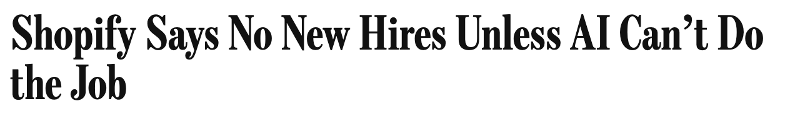
  
  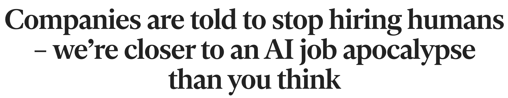
  
  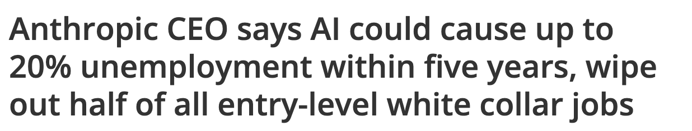
  
  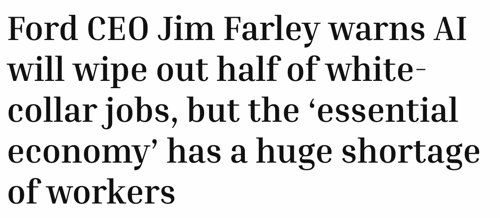
  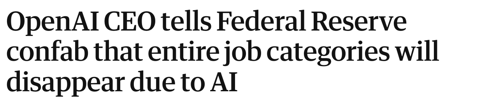
  
  
  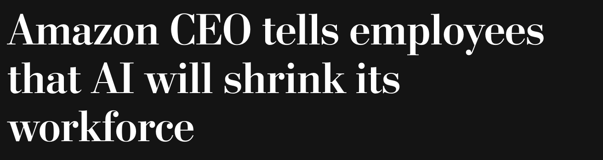
  
  
  
  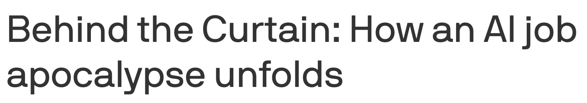
  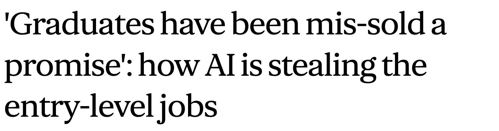
  

<!--
[Sources]
- User-provided article URLs, captured as title-only images in assets/headlines/ on 2026-08-28.
[/Sources]
-->

---
layout: center
class: image-slide
---

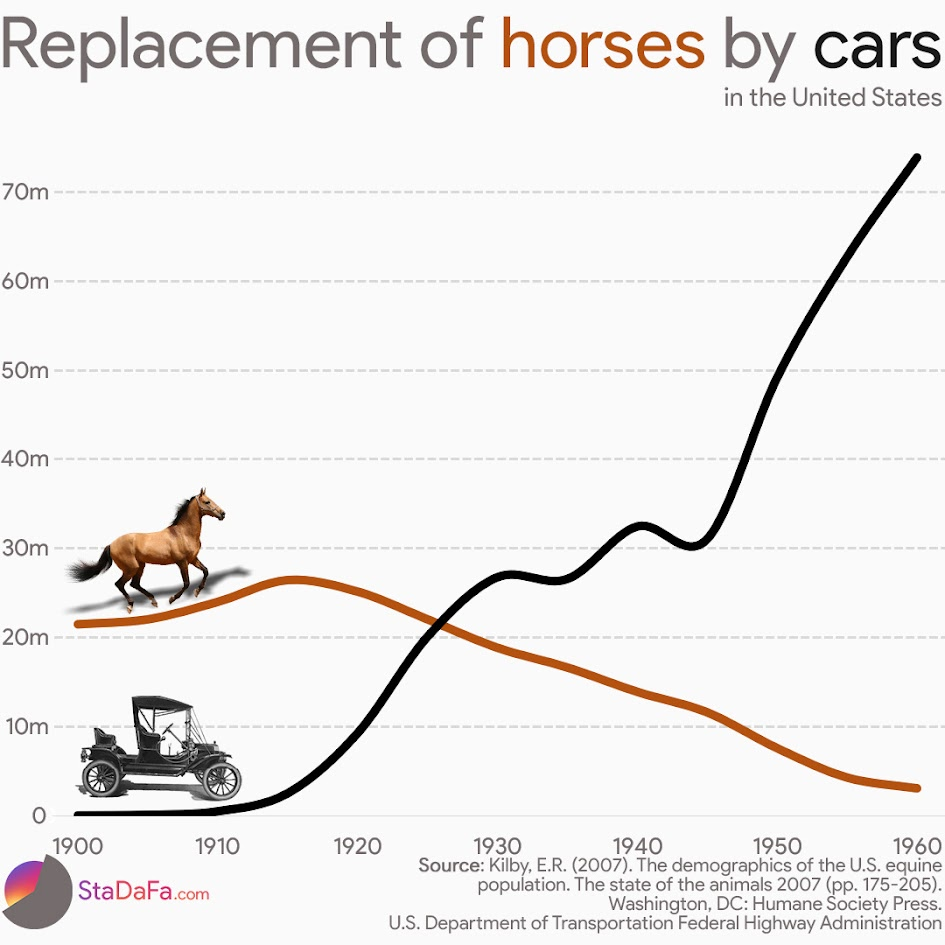

<!--
[Sources]
- StaDaFa.com chart; underlying data sources are credited within the image.
[/Sources]
-->

---
layout: center
class: statement-slide
---

# You are not a horse.

---
layout: center
class: conversion-slide
---

  

    
🥕

    
Food

  

  
→

  

    
🐎

    
Horse

  

  
→

  

    
💪

    
Mechanical work

  

---
layout: center
class: ai-claim-slide
---

# AI won’t take your job. Someone using AI will.

---
layout: center
class: ai-claim-slide ai-claim-stamped-slide
---

  <h1>AI won’t take your job. Someone using AI will.</h1>
  
Bullshit

---
layout: center
class: profession-triptych
---

  
  
  

<!--
[Sources]
- RDNE Stock project on Pexels: https://www.pexels.com/photo/a-man-sitting-at-the-table-7821715/
- Christina Morillo on Pexels: https://www.pexels.com/photo/photo-of-woman-pointing-on-white-paper-1181487/
- ThisIsEngineering on Pexels: https://www.pexels.com/photo/woman-coding-on-computer-3861958/
[/Sources]
-->

---
layout: center
class: profession-triptych
---

  
  
  

<!--
[Sources]
- Derived from the preceding Pexels photographs with robot-face overlays generated using OpenAI image generation.
[/Sources]
-->

---
layout: center
class: timeline-slide
---

<!--
[Sources]
- Original illustration generated for this presentation with OpenAI image generation.
[/Sources]
-->

---
layout: center
class: factory-video-slide
---

<SlidevVideo autoplay autoreset="slide" muted playsinline>
  <source src="./assets/factory/steam-factory.mp4" type="video/mp4" />
</SlidevVideo>

<!--
[Sources]
- User-provided video: assets/factory/steam-factory.mp4
[/Sources]
-->

---
layout: center
class: edison-slide
---

<!--
[Sources]
- U.S. National Park Service, “Thomas Edison holding bulb or test tube” (1905), public domain: https://npgallery.nps.gov/AssetDetail/49d152238b9944e280370f2672d02257
[/Sources]
-->

---
layout: center
class: electrified-factory-slide
---

  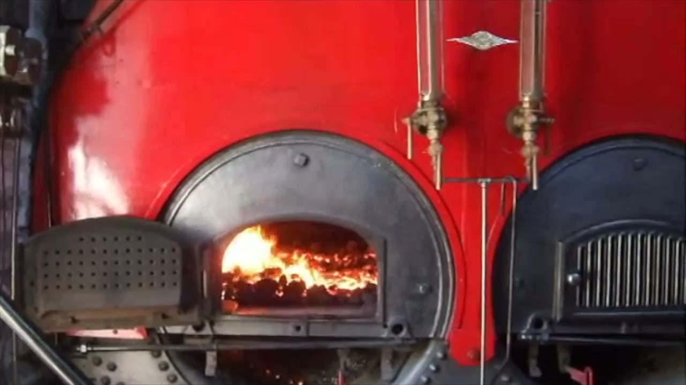
  
⚡

<!--
[Sources]
- Opening frame extracted from the user-provided video: assets/factory/steam-factory.mp4
[/Sources]
-->

---
layout: center
class: red-flag-diptych
---

  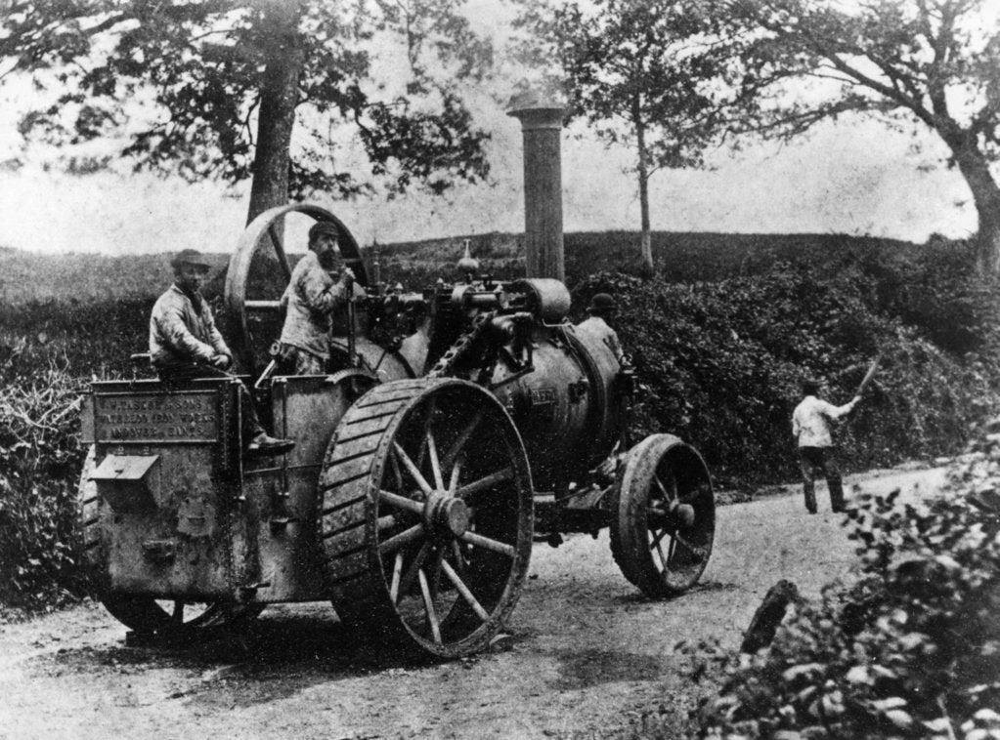
  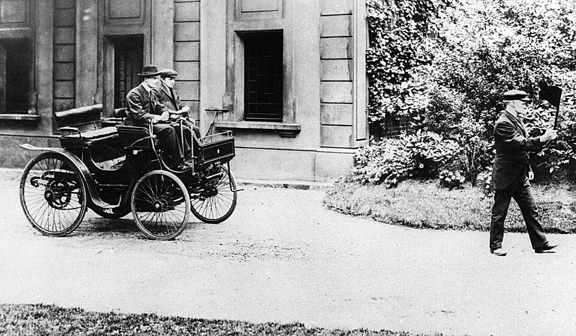

<!--
[Sources]
- User-provided image: assets/red-flag/red_flag_1.jpg
- User-provided image: assets/red-flag/red_flag_2.jpg
[/Sources]
-->

---
layout: center
class: durant-diptych
---

  

    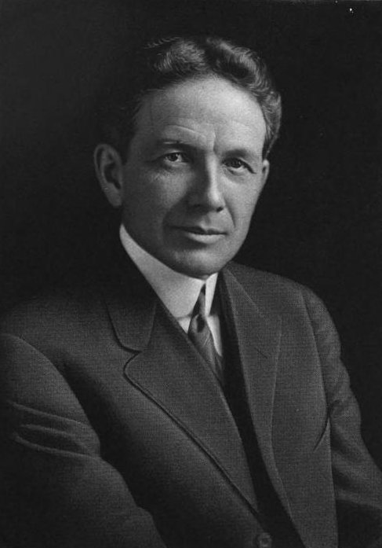
    

      1886
      <strong>William Durant</strong>
    

  

  

    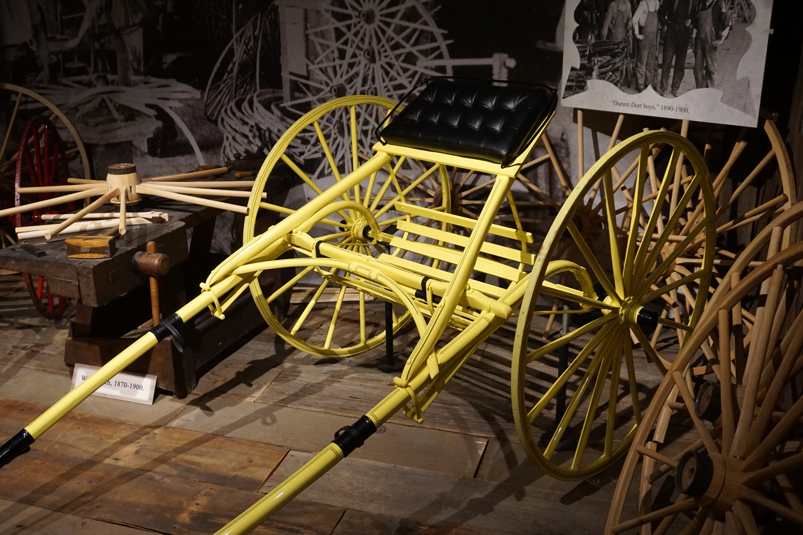
    

      Horse-drawn vehicles
      <strong>Durant-Dort Carriage Company</strong>
    

  

<!--
[Sources]
- William C. Durant portrait (1916), public domain: https://commons.wikimedia.org/wiki/File:WilliamCDurant.jpg
- Michael Barera, circa 1886–1893 Flint Road Cart Company road cart at the Sloan Museum, CC BY-SA 4.0: https://commons.wikimedia.org/wiki/File:Sloan_Museum_July_2018_09_(c._1886-1893_Flint_Road_Cart_Company_road_cart).jpg
- General Motors, “Story of GM Founder, William Durant”: https://www.gm.com/heritage
[/Sources]
-->

---
layout: center
class: durant-brands
---

  

    1904
    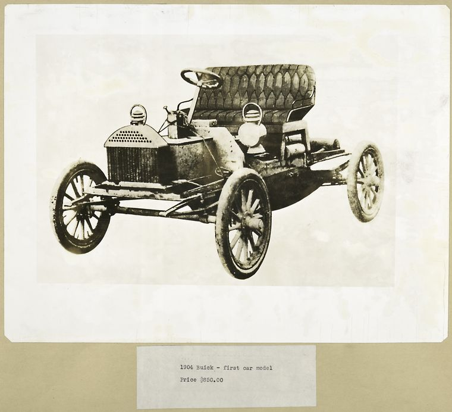
    <strong>BUICK</strong>
  

  
+

  

    1908
    <strong>GM</strong>
    GENERAL MOTORS
  

<!--
[Sources]
- Buick Model B (1904), New York Public Library Digital Collections, public domain/no known copyright restrictions: https://commons.wikimedia.org/wiki/File:1904Buick.jpg
- General Motors, “Story of GM Founder, William Durant”: https://www.gm.com/heritage
[/Sources]
-->
